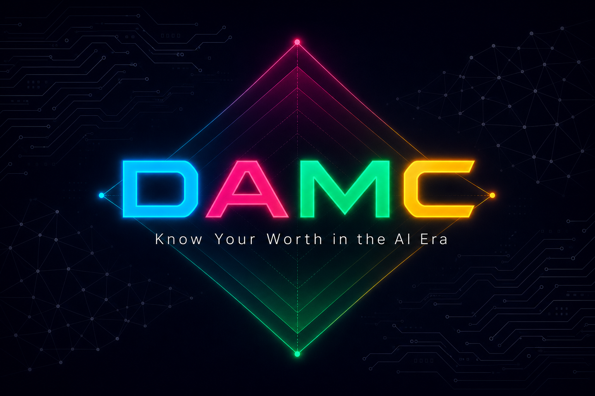
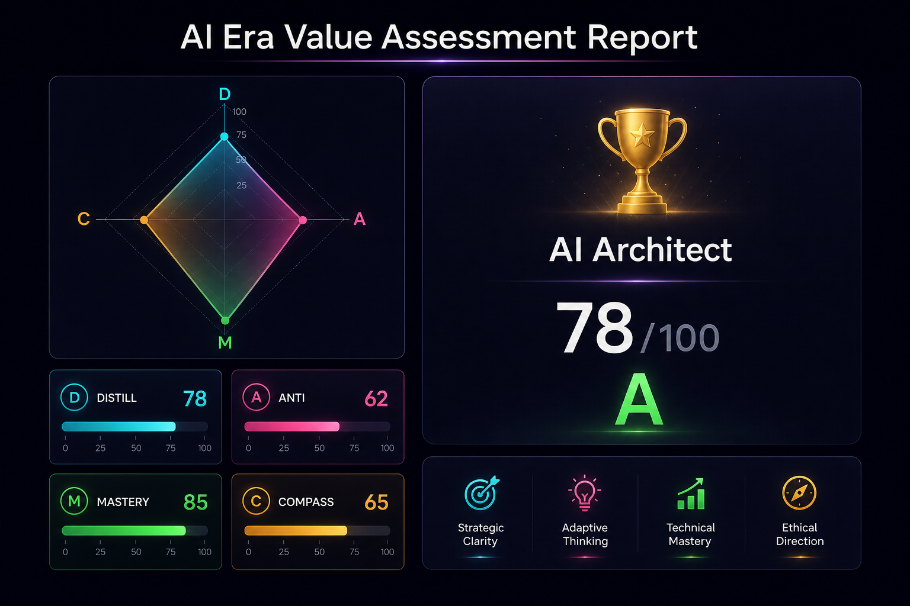

<p align="center">
  
</p>

<h1 align="center">DAMC — Know Your Worth in the AI Era</h1>

<p align="center">
  <strong>An AI-native skill that scans your AI environment, quantifies your value across 4 dimensions, and generates a personalized career report — in 30 seconds.</strong>
</p>

<p align="center">
  <a href="#quick-start">Quick Start</a> •
  <a href="#how-it-works">How It Works</a> •
  <a href="#the-damc-framework">The Framework</a> •
  <a href="#demo">Demo</a> •
  <a href="README.zh-CN.md">中文</a>
</p>

<p align="center">
  
  
  
  
</p>

---

## The Problem

> Everyone is asking: *"Will AI replace me?"* — but nobody has a real answer.

In the AI era, professionals face an existential question: **What is my real value when AI can do so much?** Current assessments are either generic personality tests or hand-wavy "AI readiness" surveys. None of them actually look at *how you use AI* to evaluate *where you stand*.

## The Solution

**DAMC** is a Claude Code skill that **uses AI to evaluate your relationship with AI**. It automatically scans your actual AI usage environment — skills, configurations, memory systems, automation pipelines, git history — and combines this with a lightweight career profile to generate a quantified, actionable assessment.

No surveys. No self-reporting bias. Just data.

<p align="center">
  
</p>

## Quick Start

### Installation

```bash
# Install via npx skills (recommended)
npx skills add https://github.com/anthropics/damc-skill

# Or clone manually
git clone https://github.com/anthropics/damc-skill.git ~/.claude/skills/damc
```

### Run Your Assessment

In Claude Code, simply type:

```
/damc
```

or say:

```
Evaluate my value in the AI era
```

That's it. DAMC handles the rest — scanning, scoring, and report generation — automatically.

## How It Works

```
┌─────────────────────────────────────────────────────────┐
│                    DAMC Workflow                         │
│                                                         │
│  ┌──────────┐   ┌──────────┐   ┌──────────┐            │
│  │  Phase 1  │──▶│  Phase 2  │──▶│  Phase 3  │           │
│  │   SCAN    │   │  PROFILE  │   │   SCORE   │           │
│  │           │   │           │   │           │           │
│  │ • Skills  │   │ 3 Quick   │   │ Scoring   │           │
│  │ • Config  │   │ Questions │   │ Algorithm │           │
│  │ • Memory  │   │           │   │ (22 sub-  │           │
│  │ • Hooks   │   │ • Role    │   │ dimensions│           │
│  │ • MCP     │   │ • Output  │   │  mapped)  │           │
│  │ • Git     │   │ • MBTI    │   │           │           │
│  └──────────┘   └──────────┘   └──────────┘            │
│        │                              │                  │
│        ▼                              ▼                  │
│  ┌──────────┐                  ┌──────────┐             │
│  │  Phase 4  │◀─────────────── │  Phase 5  │             │
│  │  REPORT   │                 │  UPLOAD   │             │
│  │           │                 │ (optional) │             │
│  │ • HTML    │                 │           │             │
│  │ • Radar   │                 │ Scores    │             │
│  │ • Career  │                 │ only —    │             │
│  │   Paths   │                 │ never raw │             │
│  └──────────┘                 │ content   │             │
│                                └──────────┘             │
└─────────────────────────────────────────────────────────┘
```

### Phase 1: Automated Scan (Zero User Input)

DAMC scans your Claude Code environment silently:

| Data Source | Signals Extracted |
|-------------|------------------|
| `~/.claude/CLAUDE.md` | Configuration depth, custom rules, workflow definitions |
| `~/.claude/skills/` | Total count, self-built vs installed, category diversity |
| `~/.claude/memory/` | Memory file count, type distribution |
| `settings.json` | Hooks count, MCP servers, permission model |
| `git log` | AI-collaborative commits (Co-Authored-By), commit frequency |
| System tools | Dev tool breadth (Node/Python/Go/Docker/K8s) |

### Phase 2: Quick Profile (3 Questions Only)

1. **What's your role?** (e.g., developer, PM, designer, marketer)
2. **What's your core output?** (e.g., code, documents, designs, decisions)
3. **Your MBTI type?** (optional — skip if you don't know)

### Phase 3: Scoring Engine

22 sub-dimensions scored across 4 dimensions, producing an overall 0-100 score and one of 8 career archetypes.

### Phase 4: Visual Report

A beautiful, self-contained HTML report with:
- Radar chart visualization
- Animated score bars
- Career archetype analysis
- Actionable recommendations
- Shareable format

## The DAMC Framework

DAMC evaluates your value through four complementary lenses:

| Dimension | Full Name | Core Question | Weight |
|-----------|-----------|---------------|--------|
| **D** | Distillation Value | Is your expertise worth distilling into an AI skill? | 25% |
| **A** | Anti-Distillation | Which of your abilities can AI never replicate? | **30%** |
| **M** | AI Mastery | How well do you wield AI tools? | 25% |
| **C** | Career Compass | Based on D, A, M — where should you go next? | 20% |

**Why A has the highest weight**: In the AI era, your irreplaceable human qualities — creativity, emotional intelligence, cross-domain thinking, ambiguity tolerance — are your ultimate moat.

### The 8 Career Archetypes

Based on High/Low combinations of D, A, M:

| Archetype | D | A | M | Description |
|-----------|---|---|---|-------------|
| 🏆 AI Architect | High | High | High | Top of the food chain — expert, irreplaceable, and AI-fluent |
| 🎯 Sleeping Expert | High | High | Low | Diamond-level expertise, just hasn't amplified it with AI yet |
| ⚡ Efficiency Machine | High | Low | High | High-output AI user, but the work itself is automatable |
| 🚨 Danger Zone | High | Low | Low | Replaceable knowledge + no AI skills = urgent action needed |
| 🌟 AI-Native Creator | Low | High | High | Value lies in creativity and judgment, AI amplifies it |
| 💎 Uncut Diamond | Low | High | Low | Irreplaceable soft skills, hasn't discovered AI leverage yet |
| 🔧 AI Tool Operator | Low | Low | High | Good at using AI, but "using tools" alone depreciates |
| 📚 Explorer | Low | Low | Low | Early career or transitioning — best time to reposition |

### Scoring Details

**M Dimension (AI Mastery)** — 100% automated, zero self-reporting:

| Sub-dimension | Max Score | Signals |
|---------------|-----------|---------|
| Environment Config | 20 | CLAUDE.md depth, keybindings, settings |
| Skill Ecosystem | 25 | Skill count, self-built ratio, category coverage |
| Automation & Integration | 20 | Hooks, MCP servers |
| Memory System | 15 | Memory files, type diversity |
| Advanced Features | 20 | Multi-project config, cron, agent teams, AI commits |

**D & A Dimensions** — hybrid scoring: automated signals (40-70%) + role-based inference (30-60%)

**C Dimension** — derived from D, A, M with optional MBTI adjustment for career path recommendations

## Privacy-First Design

DAMC is designed with a strict privacy architecture:

```
✅ What stays local (ALWAYS):
   • CLAUDE.md content
   • Memory file content  
   • Git commit messages
   • Skill names and paths
   • Project paths
   • Personal identifiers

❌ What NEVER leaves your machine:
   • Raw scan data
   • Configuration file contents
   • Any personally identifiable information

🔒 What uploads (ONLY with explicit consent):
   • Numeric scores only (D/A/M/C + 22 sub-scores)
   • Archetype name
   • Role (user-provided)
   • Aggregate scan statistics (counts only, no names)
```

Users can choose:
- **"Agree"** → Full experience with platform features
- **"Local mode"** → Everything stays on your machine
- **"Cancel"** → Exit immediately

## Technical Architecture

```
damc/
├── SKILL.md                    # Main skill definition (Claude Code format)
├── references/
│   ├── scoring-framework.md    # 22-dimension scoring algorithm
│   └── career-archetypes.md    # 8 archetype definitions + matching logic
├── templates/
│   └── report.html             # Self-contained HTML report template
│                                 (CSS + JS + SVG radar chart, no dependencies)
├── docs/
│   ├── ARCHITECTURE.md         # Technical deep-dive
│   └── assets/                 # Demo screenshots and banner
├── README.md                   # This file (English)
├── README.zh-CN.md             # Chinese version
└── LICENSE                     # MIT License
```

### Key Technical Decisions

1. **Self-contained HTML report**: Single file, no CDN dependencies, works offline. Dark theme with animated radar chart, gradient bars, and responsive design.

2. **Hybrid scoring model**: M dimension is 100% objective (automated scan), D and A blend automated signals with role-based inference, creating a balanced assessment that's neither pure black-box nor pure self-report.

3. **Score-only upload**: Privacy architecture ensures only numeric scores travel over the network. Raw content never leaves the machine.

4. **Claude Code native**: Built as a Claude Code skill — no separate backend, no browser extension, no additional setup. Just install and run.

## Global Scalability

DAMC is designed for global adoption:

- **Language-agnostic scoring**: The scan-based M dimension works regardless of language
- **Role-universal framework**: D, A, M, C dimensions apply to any profession in any country
- **Cultural adaptability**: Career archetypes map to universal workplace dynamics
- **English + Chinese**: Full bilingual support from day one
- **Zero-infrastructure**: Runs entirely within Claude Code — no servers needed for core functionality

## Commercial Potential

| Tier | Features | Model |
|------|----------|-------|
| **Free (LITE)** | 4-dimension scores + archetype + local HTML report | Open source skill |
| **Pro** | 22 sub-dimension deep dive + distillable skills list + moat analysis + 90-day action plan | Platform (damc.ai) |
| **Enterprise** | Team analytics, department benchmarking, workforce transformation insights | B2B SaaS |

## Demo

### Running DAMC

```bash
# In Claude Code terminal
> /damc

🔒 DAMC Privacy Notice (please read)
I will scan your local environment to generate an Agent Health Report...

→ Type "agree" to continue
→ Type "local" for local-only mode
→ Type "cancel" to exit

> agree

🔍 Scanning environment...
  ✅ CLAUDE.md: 150 lines, 12 custom rules
  ✅ Skills: 83 total, 5 self-built, 10 categories
  ✅ Memory: 12 files, 4 types
  ✅ Hooks: 3 configured
  ✅ MCP: 8 servers
  ✅ Git: 45/200 AI-collaborative commits

Quick profile questions...
  1. Your role: Frontend Developer
  2. Core output: Code
  3. MBTI: INTJ

📊 DAMC Assessment Complete

  D ████████░░  78    M █████████░  85
  A ██████░░░░  62    C ██████░░░░  65

  Archetype: 🏆 AI Architect
  "Deep expertise + irreplaceable skills + AI fluency = top of the food chain"

  📄 Full report saved: ~/Desktop/DAMC-Report-2026-05-25.html
```

## Contributing

Contributions welcome! Areas we'd love help with:

- **New language support**: Translate archetypes and recommendations
- **Scoring model refinement**: Suggest new signals or weighting adjustments
- **Platform integrations**: VS Code, Cursor, Windsurf skill versions
- **Enterprise features**: Team-level analytics design

## License

MIT License — see [LICENSE](LICENSE) for details.

---

<div align="center">

**Built for [UCWS Singapore Hackathon 2026](https://epicconnector.ai) — Skills Track**

*DAMC: Because in the AI era, knowing your value is the first step to multiplying it.*

</div>
